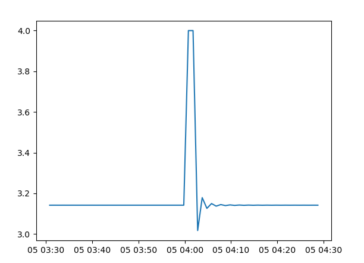
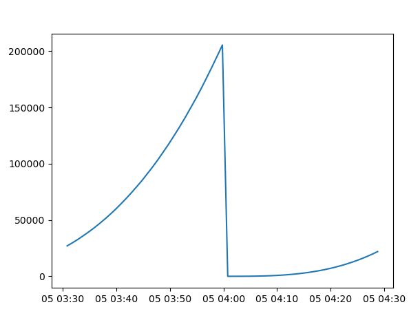
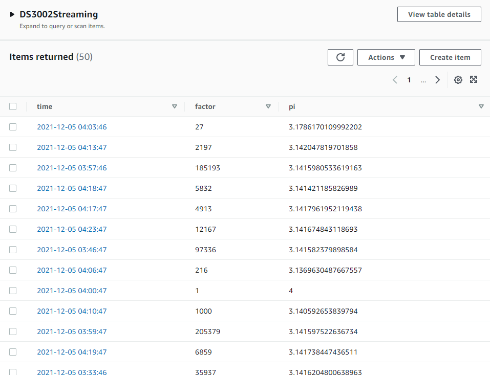

# Project 2 - Data Ingestion API
This project uses Python and DynamDB to ingest incoming data streamed from the provided API. To ensure that the queries happend once per minute, I used multi-threading and schdulers to run jobs concurrently at precisely the right time. Finally, I used pandas and matplotlib to analyze the final results.

The pi column seems to be making a heartbeat monitor shaped graph, fluctuating briefly to 4 before settling back down.

Increases almost exponentially over time before restarting at the top of the hour.

A screenshot of the DynamoDB table

Console output demonstrating proof of the function executing at the same time can be found in the `console.txt` file.